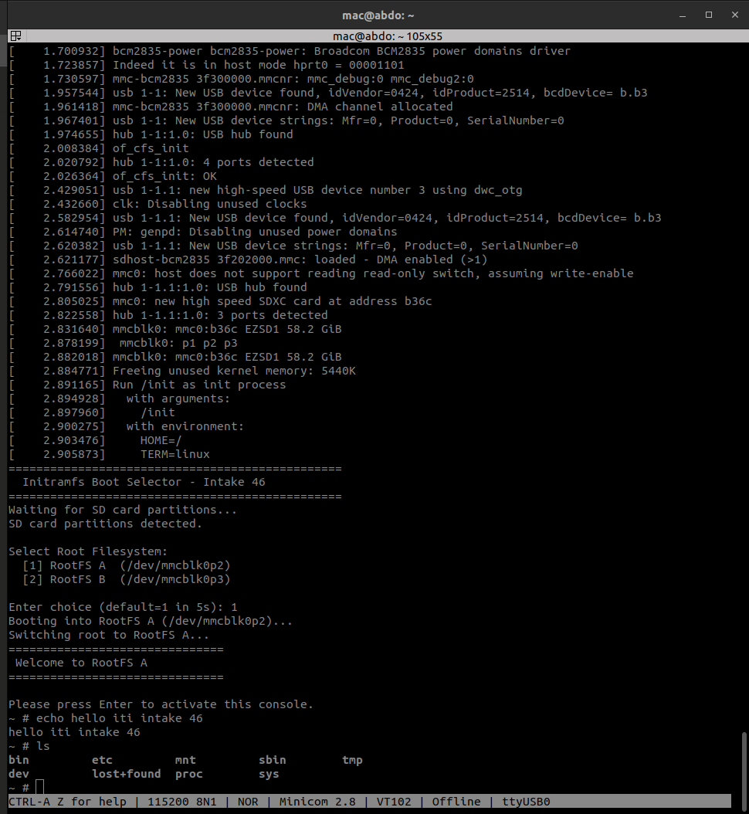
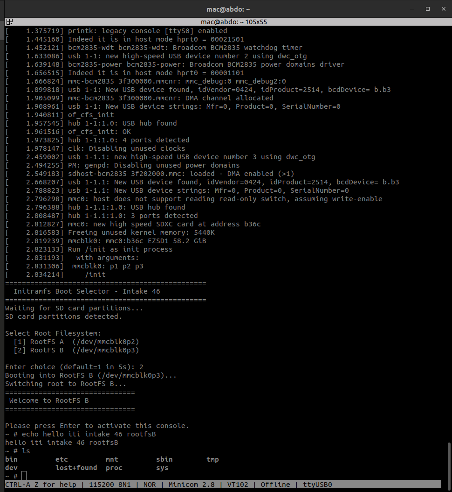
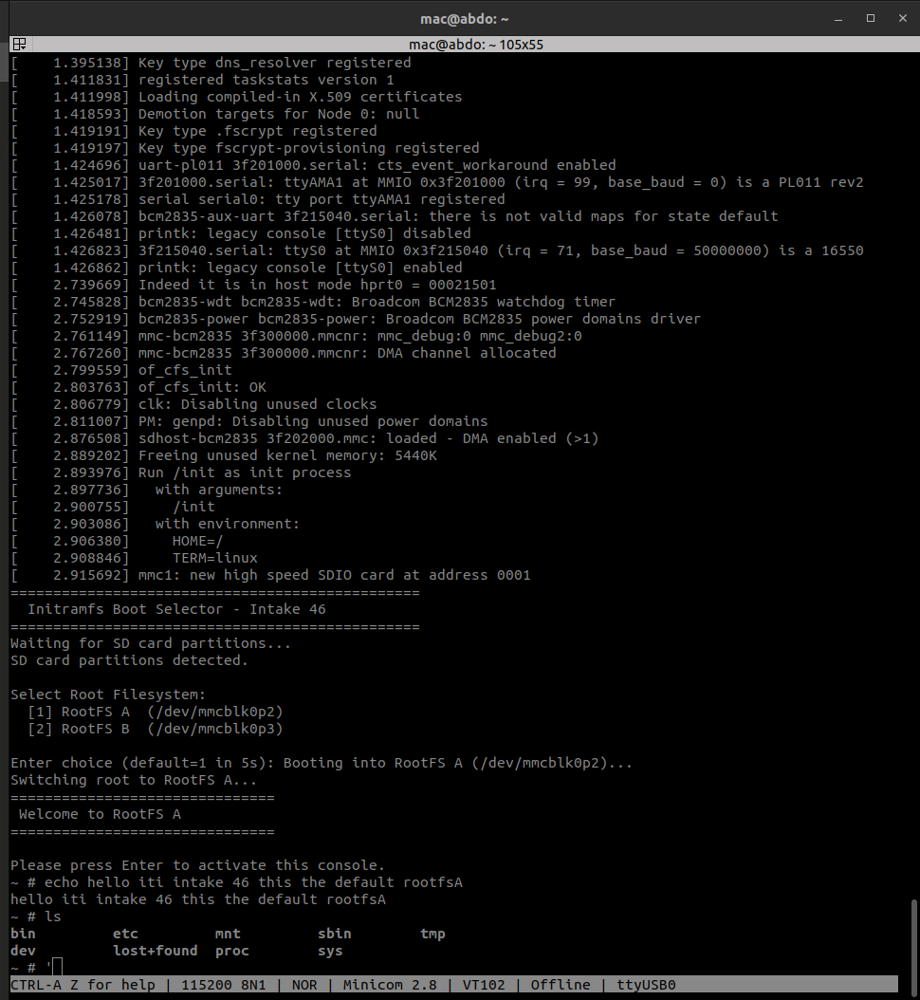

# Lab 8 — Initramfs-Based Root Filesystem Selection
### Dynamic Boot Partition Selector · Intake 46 · March 2026
### Platform: Raspberry Pi 3B+ (AArch64) · Kernel 6.12.75-v8+ · BusyBox 1.36.1

---

## What This Lab Is About

In Lab 7, initramfs was used as the **permanent rootfs** — the system lived entirely in RAM and never touched persistent storage. This lab extends that concept by turning the initramfs into an **active decision layer**: it initializes the system, presents the user with a selection menu, and then hands off execution to one of two real root filesystems stored on SD card ext4 partitions via `switch_root`.

**End result:** At every boot, the user is prompted over TTL serial to select which root filesystem to boot into. If no input is given within 5 seconds, the system defaults to RootFS A automatically.

```
================================================
  Initramfs Boot Selector - Intake 46
================================================
Waiting for SD card partitions...
SD card partitions detected.

Select Root Filesystem:
  [1] RootFS A  (/dev/mmcblk0p2)
  [2] RootFS B  (/dev/mmcblk0p3)

Enter choice (default=1 in 5s):
```

---

## System Architecture

```
┌─────────────────────────────────────────────────────────────┐
│                      SD Card Layout                          │
│                                                             │
│  sdc1 (200MB FAT32)     sdc2 (500MB ext4)  sdc3 (57.6G ext4)│
│  ┌──────────────┐       ┌──────────────┐   ┌──────────────┐ │
│  │  BOOT        │       │  rootfsA     │   │  rootfsB     │ │
│  │  Image       │       │  BusyBox     │   │  BusyBox     │ │
│  │  DTB         │       │  /sbin/init  │   │  /sbin/init  │ │
│  │  u-boot.bin  │       │  /etc/inittab│   │  /etc/inittab│ │
│  │  initramfs   │       │  rcS banner A│   │  rcS banner B│ │
│  └──────────────┘       └──────────────┘   └──────────────┘ │
└─────────────────────────────────────────────────────────────┘
```

---

## Boot Flow

```
GPU ROM → bootcode.bin → start.elf → U-Boot
                                        │
                              loads Image + DTB + initramfs
                                        │
                                   Kernel boots
                                        │
                              Unpacks initramfs into tmpfs
                                        │
                                  Runs /init (PID 1)
                                        │
                              mount /proc /sys /dev
                              echo 3 > /proc/sys/kernel/printk
                                        │
                              Poll for /dev/mmcblk0p2 and p3
                                        │
                              Display selection menu
                              read -t 5 CHOICE
                                        │
                          ┌─────────────┴─────────────┐
                     CHOICE=1                      CHOICE=2
                  (or timeout)
                          │                            │
                  mount mmcblk0p2              mount mmcblk0p3
                  to /mnt/newroot              to /mnt/newroot
                          │                            │
                          └─────────────┬─────────────┘
                                        │
                              exec switch_root /mnt/newroot /sbin/init
                                        │
                              initramfs memory freed
                              PID 1 replaced by real init
                                        │
                              ===============================
                               Welcome to RootFS A (or B)
                              ===============================
```

---

## Key Concepts

### `switch_root` vs `chroot`

| | `chroot` | `switch_root` |
|---|---|---|
| Changes root mount | No — overlay only | Yes — replaces `/` entirely |
| Frees initramfs RAM | No | Yes — tmpfs is freed |
| PID 1 replacement | No — forks | Yes — `exec`, same PID |
| Used for | Debugging, containers | Permanent rootfs handoff |

`switch_root` must be called with `exec` — without it, the shell remains as PID 1 and the system behaves incorrectly.

### Why `echo 3 > /proc/sys/kernel/printk`

With `loglevel=8` in bootargs, the kernel floods the serial console with messages (USB enumeration, MMC init, etc.) during the 5-second `read` window. This noise gets injected into stdin and corrupts the `read` input, causing automatic selection without user interaction. Setting printk console level to 3 (errors only) after `/proc` is mounted silences this before the prompt appears.

### MMC Partition Detection Polling

The MMC driver initializes asynchronously. `/dev/mmcblk0p2` and `/dev/mmcblk0p3` may not exist in `/dev` at the moment `/init` starts. The polling loop:

```sh
while [ ! -b /dev/mmcblk0p2 ] || [ ! -b /dev/mmcblk0p3 ]; do
    sleep 1
    COUNT=$((COUNT + 1))
    if [ $COUNT -ge $TIMEOUT ]; then
        exec /bin/sh   # emergency shell on timeout
    fi
done
```

On RPi 3B+, detection typically completes within 1–2 seconds. The 10-second timeout prevents an infinite hang on hardware failure.

### Static Linking Requirement

Both rootfs partitions use BusyBox **statically linked**. When `switch_root` execs `/sbin/init` on the new rootfs, the dynamic linker would need `libc.so` in `/lib` — which doesn't exist in our minimal rootfs. Static linking eliminates this dependency entirely.

---

## Directory Structure

### initramfs (Boot Selector)

```
initramfs_task8/
├── bin/
│   ├── busybox          ← statically linked, AArch64
│   ├── sh  → /bin/busybox
│   └── [all applets] → /bin/busybox
├── sbin/
│   └── init → /bin/busybox
├── etc/
│   ├── inittab
│   └── init.d/
│       └── rcS
├── dev/
│   ├── console          ← c 5 1 (must be static, devtmpfs not mounted yet)
│   ├── null             ← c 1 3
│   └── tty              ← c 5 0
├── proc/                ← mount point for procfs
├── sys/                 ← mount point for sysfs
├── mnt/                 ← used as switch_root target
└── init                 ← shell script, PID 1 entry point
```

### rootfsA and rootfsB (Target Filesystems)

```
/mnt/rootfsA (or B)/
├── bin/
│   ├── busybox
│   ├── sh  → /bin/busybox
│   ├── ls, cat, echo, mount → /bin/busybox
├── sbin/
│   └── init → /bin/busybox
├── etc/
│   ├── inittab
│   └── init.d/
│       └── rcS          ← prints "Welcome to RootFS A (or B)"
├── dev/
│   ├── console, null, tty
├── proc/ sys/ tmp/ mnt/
└── lost+found           ← ext4 fsck recovery dir (auto-created by mkfs.ext4)
```

---

## `/init` Script (Full)

```sh
#!/bin/sh

# Mount virtual filesystems
mount -t proc  none /proc
echo 3 > /proc/sys/kernel/printk     # suppress kernel log noise during read
mount -t sysfs none /sys
mount -t devtmpfs none /dev

echo "================================================"
echo "  Initramfs Boot Selector - Intake 46"
echo "================================================"

# Wait for MMC partitions to be detected (async MMC init)
echo "Waiting for SD card partitions..."
TIMEOUT=10
COUNT=0
while [ ! -b /dev/mmcblk0p2 ] || [ ! -b /dev/mmcblk0p3 ]; do
    sleep 1
    COUNT=$((COUNT + 1))
    if [ $COUNT -ge $TIMEOUT ]; then
        echo "ERROR: SD card partitions not found after ${TIMEOUT}s"
        echo "Dropping to emergency shell..."
        exec /bin/sh
    fi
done
echo "SD card partitions detected."

# Prompt user
echo ""
echo "Select Root Filesystem:"
echo "  [1] RootFS A  (/dev/mmcblk0p2)"
echo "  [2] RootFS B  (/dev/mmcblk0p3)"
echo ""
printf "Enter choice (default=1 in 5s): "

read -t 5 CHOICE
CHOICE=${CHOICE:-1}

# Select partition
case "$CHOICE" in
    1)
        PARTITION=/dev/mmcblk0p2
        LABEL="RootFS A"
        ;;
    2)
        PARTITION=/dev/mmcblk0p3
        LABEL="RootFS B"
        ;;
    *)
        echo "Invalid choice. Defaulting to RootFS A."
        PARTITION=/dev/mmcblk0p2
        LABEL="RootFS A"
        ;;
esac

echo "Booting into ${LABEL} (${PARTITION})..."

# Mount selected partition
mkdir -p /mnt/newroot
mount -t ext4 $PARTITION /mnt/newroot

if [ $? -ne 0 ]; then
    echo "ERROR: Failed to mount ${PARTITION}"
    exec /bin/sh
fi

# Verify /sbin/init exists on target before handing off
if [ ! -x /mnt/newroot/sbin/init ]; then
    echo "ERROR: /sbin/init not found on ${PARTITION}"
    exec /bin/sh
fi

echo "Switching root to ${LABEL}..."
exec switch_root /mnt/newroot /sbin/init

# Should never reach here
echo "FATAL: switch_root failed"
exec /bin/sh
```

---

## SD Card Preparation Steps

### 1. Repartition

```bash
sudo fdisk /dev/sdc
# d 2           → delete old partition 2
# n p 2 +500M   → create rootfsA (500MB)
# n p 3 <Enter> → create rootfsB (remaining ~57.6GB)
# w             → write
```

### 2. Format

```bash
sudo mkfs.ext4 -L rootfsA /dev/sdc2
sudo mkfs.ext4 -L rootfsB /dev/sdc3
```

### 3. Populate Both Rootfs Partitions

```bash
sudo mkdir -p /mnt/rootfsA /mnt/rootfsB
sudo mount /dev/sdc2 /mnt/rootfsA
sudo mount /dev/sdc3 /mnt/rootfsB

for ROOTFS in /mnt/rootfsA /mnt/rootfsB; do
    sudo mkdir -p $ROOTFS/{bin,sbin,etc/init.d,proc,sys,dev,tmp,mnt}
    sudo cp /path/to/busybox $ROOTFS/bin/busybox
    sudo chmod +x $ROOTFS/bin/busybox
    sudo ln -sf /bin/busybox $ROOTFS/bin/sh
    sudo ln -sf /bin/busybox $ROOTFS/sbin/init
    sudo mknod $ROOTFS/dev/console c 5 1
    sudo mknod $ROOTFS/dev/null    c 1 3
    sudo mknod $ROOTFS/dev/tty     c 5 0
done
```

### 4. Build initramfs

```bash
cd initramfs_task8
find . | cpio -H newc -o | gzip > ../rootramfs_task8.cpio.gz
```

### 5. Update boot.cmd

```bash
echo "=== Embedded Linux Boot Selector - Intake 46 ==="
fatload mmc 0:1 ${kernel_addr_r} Image
fatload mmc 0:1 ${fdt_addr_r} bcm2710-rpi-3-b-plus.dtb
fatload mmc 0:1 0x02700000 rootramfs_task8.cpio.gz
setenv bootargs "console=ttyS0,115200 8250.nr_uarts=1 rdinit=/init loglevel=8"
booti ${kernel_addr_r} 0x02700000:${filesize} ${fdt_addr_r}
```

```bash
mkimage -C none -A arm64 -T script -d boot.cmd boot.scr
```

---

## Final SD Card Layout

```
/media/mac/BOOT/
├── Image                          ← kernel (27MB)
├── bcm2710-rpi-3-b-plus.dtb       ← device tree blob
├── rootramfs_task8.cpio.gz        ← NEW initramfs with boot selector (1.2MB)
├── rootramfs_clean.cpio.gz        ← Lab 7 initramfs (kept as backup)
├── boot.cmd                       ← updated boot script
├── boot.scr                       ← compiled boot script
├── config.txt                     ← GPU configuration
├── bootcode.bin                   ← GPU stage 1 bootloader
├── start.elf                      ← GPU firmware
├── fixup.dat                      ← GPU/ARM memory split
└── u-boot.bin                     ← U-Boot bootloader
```

---

## Proof of Work

### Test 1 — Select RootFS A (explicit input: `1`)



User enters `1`. System mounts `/dev/mmcblk0p2`, runs `switch_root`, and boots into RootFS A showing the `Welcome to RootFS A` banner.

---

### Test 2 — Select RootFS B (explicit input: `2`)



User enters `2`. System mounts `/dev/mmcblk0p3`, runs `switch_root`, and boots into RootFS B showing the `Welcome to RootFS B` banner.

---

### Test 3 — Default Timeout (no input, 5 seconds elapsed)



No input provided. After 5 seconds, `read -t 5` times out, `CHOICE` defaults to `1`, and the system boots into RootFS A automatically.

---

## Technical Issues Encountered and Resolved

### Issue 1 — Kernel Log Corrupting `read` Input

**Symptom:** System selected RootFS A automatically without waiting for user input. Serial log showed kernel USB enumeration messages interleaved with the prompt, with a stray `1` appearing in the output.

**Root Cause:** `loglevel=8` causes the kernel to print all log messages to `ttyS0`. During the 5-second `read` window, USB and network driver initialization messages were printed to the console, injecting characters into stdin and triggering the `read` to return immediately with garbage input, which matched the default case.

**Fix:** Added `echo 3 > /proc/sys/kernel/printk` immediately after mounting `/proc`, before displaying the menu. This sets the console log level to errors-only for the duration of user interaction.

### Issue 2 — Symlink Path Bug (inherited from Lab 7)

**Symptom:** BusyBox symlinks created with `busybox --install -s` from outside the initramfs directory point to the full host path (e.g., `/home/mac/workspace/.../busybox`), which does not exist on the RPi.

**Fix:** Always create symlinks manually with absolute target paths:
```bash
ln -sf /bin/busybox bin/sh   # /bin/busybox = path on target
```

---

## RAM Layout at Boot

```
Address          Contents                        Status after boot
────────────────────────────────────────────────────────────────────
0x00080000       Kernel Image (27MB)             Stays — runs forever
0x05600000       DTB (35KB)                      Stays — kernel uses it
0x02700000       rootramfs_task8.cpio.gz (1.2MB) Freed after decompression
tmpfs            Unpacked initramfs              Freed after switch_root
mmcblk0p2/p3     Selected ext4 rootfs            Mounted as new /
────────────────────────────────────────────────────────────────────
```

---

*Embedded Linux · Lab 8 · Intake 46 · March 2026*
*Raspberry Pi 3B+ · AArch64 · Kernel 6.12.75-v8+ · BusyBox 1.36.1*
