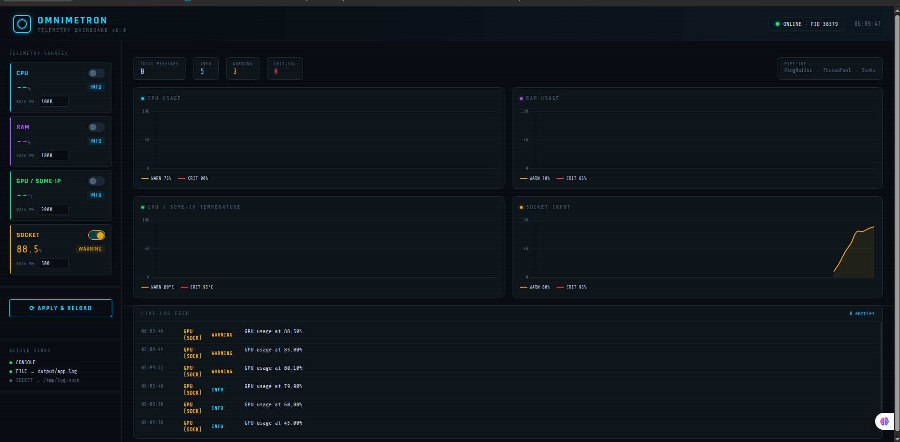

# OmniMetron — Embedded Telemetry & Logging System

> A production-grade C++17 telemetry and logging system built from scratch over 6 phases, demonstrating advanced software engineering patterns including the Façade, Builder, Factory, Observer, and Singleton design patterns, cross-compilation for ARM64 (Raspberry Pi 3), and real-time IPC via SOME/IP middleware.

---

## 📸 Live Dashboard



> Real-time telemetry dashboard showing CPU, RAM, GPU (via SOME/IP from RPi3), and Socket input — all routed and severity-classified live.

---

## 🏗️ Architecture Overview

```
┌─────────────────────────────────────────────────────────────────┐
│                        TelemetrySystem (Façade)                 │
│                         app_config.json                         │
├──────────────┬──────────────┬──────────────┬────────────────────┤
│  CPU Source  │  RAM Source  │  GPU/SomeIP  │   Socket Source    │
│  /proc/stat  │ /proc/meminfo│  RPi3→SOME/IP│  /tmp/telemetry   │
└──────┬───────┴──────┬───────┴──────┬───────┴──────┬─────────────┘
       │              │              │               │
       └──────────────┴──────────────┴───────────────┘
                              │
                    ┌─────────▼─────────┐
                    │    RingBuffer      │
                    │   (lock-free)      │
                    └─────────┬─────────┘
                              │
                    ┌─────────▼─────────┐
                    │    ThreadPool      │
                    │  (N worker threads)│
                    └─────────┬─────────┘
                              │
              ┌───────────────┼───────────────┐
              ▼               ▼               ▼
       ConsoleSink       FileSink        SocketSink
       (stdout)      (output/app.log)  (/tmp/log.sock)
                              │
                    ┌─────────▼─────────┐
                    │  Python Dashboard  │
                    │  Flask + SSE       │
                    │  localhost:5000    │
                    └───────────────────┘
```

---

## ✨ Key Features

| Feature | Description |
|---|---|
| **6-Phase Architecture** | Incrementally built from basic logging to a full distributed telemetry system |
| **Façade Pattern** | `TelemetrySystem` hides 80+ lines of wiring behind 4 clean methods |
| **JSON Configuration** | Runtime reconfiguration via `app_config.json` — no recompile needed |
| **Live Config Reload** | `SIGHUP` signal triggers hot-reload without restarting the process |
| **SOME/IP Middleware** | CommonAPI + vsomeip for IPC between PC and Raspberry Pi 3 |
| **Cross-Compilation** | ARM64 binary built on PC and deployed to RPi3 via CMake toolchain |
| **ThreadPool + RingBuffer** | Non-blocking producer/consumer pipeline for high-throughput logging |
| **Live Dashboard** | Flask server-sent events dashboard with real-time charts and severity alerts |
| **Multiple Sinks** | Console, File, and Socket sinks — all configurable at runtime |
| **Multiple Sources** | CPU (`/proc/stat`), RAM (`/proc/meminfo`), GPU (SOME/IP), Socket (Unix domain) |

---

## 🔧 Design Patterns Used

| Pattern | Where | Purpose |
|---|---|---|
| **Façade** | `TelemetrySystem` | Single entry point hiding all subsystem complexity |
| **Builder** | `LogManagerBuilder` | Fluent construction of LogManager with sinks |
| **Factory** | `LogSinkFactory` | Creates sink instances by type enum |
| **Singleton** | `GpuServiceImpl` | One CommonAPI runtime instance across all components |
| **Observer** | `TelemetryReader<Policy>` | Polls source and pushes to LogManager |
| **Strategy** | `CpuPolicy / RamPolicy / GpuPolicy` | Interchangeable severity inference logic |
| **RAII** | `SafeFile / SafeSocket` | Resource lifetime tied to object lifetime |
| **Type Erasure** | `TelemetrySystem` internals | Stores typed readers as `shared_ptr<void>` |

---

## 📁 Project Structure

```
PHASES_INTEGRATION/
├── app/                        # Main executable (main.cpp)
├── src/                        # All C++ source files (Phases 1–6)
│   ├── generated/              # CommonAPI generated SOME/IP code
│   └── fidl/                   # FIDL/FDEPL interface definitions
├── include/                    # All header files
├── tools/                      # gpu_service — deployed to RPi3
├── tests/                      # Unit + integration tests
├── config/
│   ├── app_config.json         # Runtime configuration
│   ├── vsomeip-client.json     # SOME/IP client config
│   └── vsomeip-service.json    # SOME/IP service config
├── cmake/
│   └── aarch64-rpi3.cmake      # ARM64 cross-compilation toolchain
├── dashboard/
│   └── index.html              # Live telemetry dashboard UI
├── output/
│   └── app.log                 # Live log output
├── dashboard.py                # Flask dashboard server
├── demo_socket.sh              # Socket source demo script
└── run_demo.sh                 # One-command demo launcher
```

---

## 🚀 Build & Run

### Prerequisites

```bash
# Required libraries (install on host PC)
sudo apt install libvsomeip3-dev libcommonapi-dev libcommonapi-someip-dev

# For cross-compilation (RPi3)
# Install crosstool-NG toolchain: aarch64-rpi3-linux-gnu
```

### Build (PC — x86_64)

```bash
git clone <repo-url>
cd PHASES_INTEGRATION
cmake -B build
cmake --build build
```

### Build (RPi3 — ARM64 cross-compile)

```bash
cmake -B build_rpi3 -DCMAKE_TOOLCHAIN_FILE=cmake/aarch64-rpi3.cmake
cmake --build build_rpi3
scp build_rpi3/tools/gpu_service pi@<rpi3-ip>:~/
```

---

## 🎬 Running the Demo

### One-Command Launch

```bash
chmod +x run_demo.sh
./run_demo.sh
```

This opens:
- **Terminal 1** — C++ telemetry engine (live log output)
- **Terminal 2** — Python dashboard server (Flask + SSE)
- **Browser** — `http://localhost:5000` (auto-opens after 3 seconds)

### With Socket Demo

```bash
./run_demo.sh --socket
```

Adds a third terminal that walks through INFO → WARNING → CRITICAL → RECOVERY cycle on the Socket Input chart.

### With RPi3 GPU Source

```bash
# On RPi3 (SSH):
VSOMEIP_CONFIGURATION=vsomeip-service.json ./gpu_service

# On PC:
./run_demo.sh
# Enable GPU/SOME-IP toggle in dashboard → Apply & Reload
```

### Stop Everything

```bash
./run_demo.sh --stop
```

---

## ⚙️ Runtime Configuration

All sources and sinks are controlled via `config/app_config.json`:

```json
{
    "log_manager": {
        "buffer_size": 100,
        "thread_pool_size": 4
    },
    "sinks": {
        "console": { "enabled": true },
        "file":    { "enabled": true, "path": "output/app.log" },
        "socket":  { "enabled": false, "path": "/tmp/log.sock" }
    },
    "sources": {
        "cpu":       { "enabled": true,  "parse_rate_ms": 1000 },
        "ram":       { "enabled": true,  "parse_rate_ms": 1000 },
        "gpu_someip":{ "enabled": false, "parse_rate_ms": 2000 },
        "socket":    { "enabled": false, "parse_rate_ms": 500  }
    }
}
```

**Live reload** — change any value in the dashboard UI and click **Apply & Reload**. The C++ app receives `SIGHUP`, tears down all sources and sinks, and rebuilds from the new JSON — zero downtime.

---

## 📊 Dashboard Features

| Feature | Description |
|---|---|
| **Live Charts** | CPU, RAM, GPU/SomeIP, Socket — 60-point rolling window |
| **Severity Alerts** | INFO / WARNING / CRITICAL with color coding and blinking on critical |
| **Live Log Feed** | Real-time log stream via Server-Sent Events (SSE) |
| **Source Toggles** | Enable/disable any source at runtime |
| **Rate Control** | Adjust polling rate per source (ms) |
| **Sink Status** | Shows active sinks with paths |
| **App Status** | Online/Offline indicator with PID |

---

## 🔬 Phase-by-Phase Development

| Phase | What Was Built |
|---|---|
| **Phase 1** | `LogManager`, `LogMessage`, `ConsoleSink`, `FileSink` — basic logging pipeline |
| **Phase 2** | `SafeFile`, `SafeSocket`, `FileTelemetrySource`, `SocketTelemetrySource` — data layer |
| **Phase 3** | `LogManagerBuilder`, `LogSinkFactory`, `SocketSink` — Builder + Factory patterns |
| **Phase 4** | `ThreadPool`, `RingBuffer`, `TelemetryReader<Policy>` — concurrent processing |
| **Phase 5** | `SomeIPTelemetrySource`, CommonAPI integration, `GpuServiceImpl` on RPi3 |
| **Phase 6** | `TelemetrySystem` Façade, `app_config.json`, `SystemTelemetryWriter`, live dashboard |

---

## 🛠️ Technical Stack

| Layer | Technology |
|---|---|
| **Language** | C++17 |
| **Build System** | CMake 3.16+ |
| **IPC Middleware** | SOME/IP via vsomeip3 + CommonAPI |
| **Interface Definition** | FIDL/FDEPL (Franca IDL) |
| **JSON Parsing** | nlohmann/json (single-header) |
| **Cross-Compilation** | crosstool-NG — aarch64-rpi3-linux-gnu |
| **Dashboard Backend** | Python 3 + Flask |
| **Dashboard Frontend** | Vanilla JS + Chart.js + Server-Sent Events |
| **Target Hardware** | Raspberry Pi 3 (ARM Cortex-A53, aarch64) |

---

## 📄 License

This project was developed as a comprehensive C++ systems programming exercise demonstrating production-grade embedded software engineering practices.
