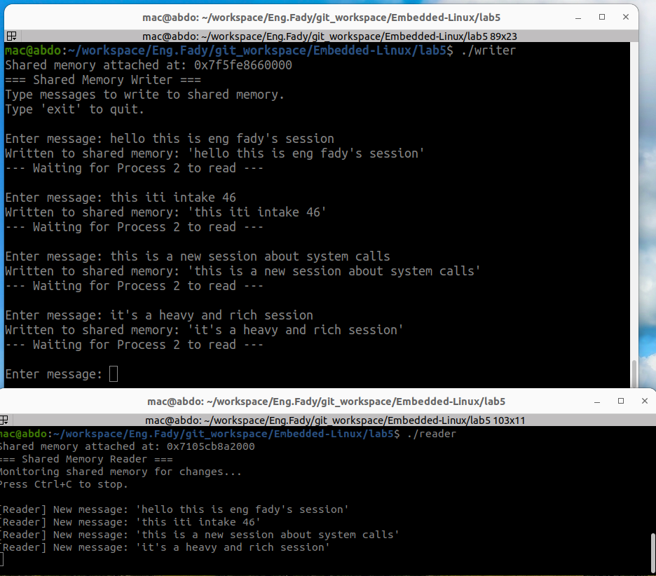

## 🧩 Shared Memory Initialization and Cleanup (System V IPC)

This part of the program demonstrates how to **create, attach, use, detach, and remove a shared memory segment** using the **System V IPC API** in Linux.

---

### 🧠 Overview

Shared memory allows multiple processes to communicate efficiently by reading and writing to a **common memory region**.  
Unlike message queues or pipes, shared memory avoids copying data through the kernel — all processes access the same physical memory.

---

### ⚙️ Code Implementation

```c
#include <stdio.h>
#include <sys/ipc.h>
#include <sys/shm.h>

const char *path = "/home/mac/workspace/Eng.Fady/git_workspace/Embedded-Linux/lab5";
int size = 1024; // example buffer size in bytes

// 1️⃣ Generate a unique key based on a file path and project ID.
int key = ftok(path, 'A');

// 2️⃣ Create or get a shared memory segment identified by the key.
int shmid = shmget(key, size, 0644 | IPC_CREAT);

// 3️⃣ Attach the shared memory segment to the process’s address space.
void *shared_mem_ptr = shmat(shmid, NULL, 0);

// ✅ At this point, shared_mem_ptr points to a memory region
//    that can be read/written by all processes using the same key.
printf("Shared memory attached at address: %p\n", shared_mem_ptr);

// ... (read/write operations go here) ...

// 4️⃣ Detach the shared memory segment when finished.
shmdt(shared_mem_ptr);

// 5️⃣ Optional: Remove the shared memory segment from the system.
shmctl(shmid, IPC_RMID, NULL);


## ✅ Validation Screenshot

