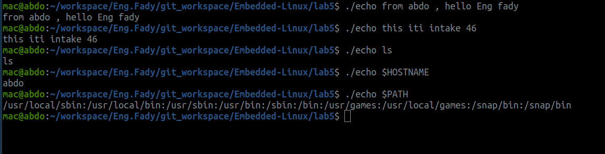

# 🧩 Inline Assembly System Call — `my_printf`

## 🧠 Overview

This project re-implements a simplified version of the `printf()` / `echo` functionality using **inline assembly** to call the Linux kernel directly through the `sys_write` system call.  
It demonstrates how data is sent from user space to the kernel without using any C standard library functions.

---

## ⚙️ Function Implementation — `my_printf`

```c
#include <stdio.h>

/**
 * my_printf - Minimal printf using inline assembly and Linux syscalls.
 * @buffer: Pointer to the message to print.
 * @size:   Number of bytes to print.
 *
 * This function manually performs the system call equivalent to:
 *     write(1, buffer, size);
 * using registers according to the x86-64 Linux syscall convention.
 */
void my_printf(const char *buffer, long size) {
    __asm__ volatile (
        // System call number: 1 → sys_write
        "mov $1, %%rax\n\t"

        // File descriptor: 1 → stdout
        "mov $1, %%rdi\n\t"

        // Pointer to buffer (2nd argument)
        "mov %0, %%rsi\n\t"

        // Number of bytes to write (3rd argument)
        "mov %1, %%rdx\n\t"

        // Execute the system call
        "syscall"
        :
        : "r"(buffer), "r"(size)
        : "rax", "rdi", "rsi", "rdx", "rcx", "r11", "memory"
    );
}
## ✅ Validation Screenshot

Below is the output of the custom `echo` program which uses `my_printf()` internally:

